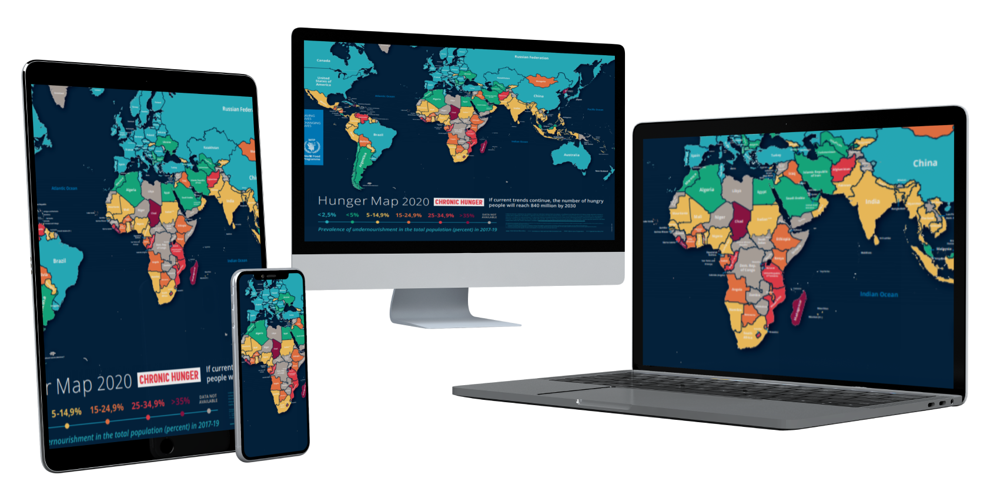

When land is scarce, most farmers cut down trees to plant crops. But having trees and crops or animals together on the same piece of land (agroforestry) makes farmland more productive and allows for greater variety.

My collaborator Gabriel KOIVOGUI and I conducted a project that confirms this, demonstrating that agroforestry serves these three objectives of agriculture: food production, rural development, and environmental protection.

This kind of practice would be valuable anywhere, but is especially useful in Africa, where undernourishment of the population remains stubbornly high.

According to the <a href="https://www.wfp.org/publications/hunger-map-2020/" target="_blank">World Food Program (WFP)</a>, the map below, most African countries have higher prevalence of undernourishment in the population. For WFP, if current trends continue, the number of hungry people will reach 840 million by 2030 in the world.

Growing up in Guinea, my colleague and I were well aware of the challenge of undernourishment. We studied environmental science in college and were excited of to work on this research project, even moreso when we visited rural communities with the team of Dr. Famoï BÉAVOGUI, a director of the Guinea Agricultural Research Institute. Walking through the farmlands, interviewing farmers, sleeping under their roofs, and listening to them, we realize the importance of agroforestry in providing a wide range of economic, sociocultural, and environmental benefits.

Dr. Famoï’s question was, “How can agroforestry practices meet the needs of farmers in their current environment?” The answer would lead to our graduation.

We explored the landscape and learned how agroforest farmlands are structured. The most striking feature relates to the differences

We also decided to evaluate the “place” of agroforestry products in the household economy of every selected agroforest farmland. This economic analysis showed that the highest gross potential income generated from one village’s agroforestry products activity was US $ 2,913,95 in 2008. Developing a strong rural policy can help bridge the gap in care for rural women’s activities.

Researchers who were supporting us added other information, including soil amelioration by trees in agroforest farming and the growth of nitrogen-fixing trees, that play an important role in the conservation of biodiversity within deforested, fragmented landscapes, by providing habitats and resources for plant and animal species.

Agroforestry farmland crops also help secure and reduce soil erosion, improve soil structure by reducing the impact of raindrops.

While agroforestry farmland owners, mostly women, use basic and traditional techniques, the demand for agroforest products (such as shea butter) continues to grow more popular. Strengthening women’s work by supplying them with new equipment will add more value to their efforts, and allow them to gain more experience that will add value to rural communities.

While the popularity of forest products (shea butter, cocoa, or wine) is just one measure of success, agroforestry has already had a positive impact on scientific community. We hope to help more women who are their struggling with a lack of agricultural and economical services.

We knew that while women may lack financial supports, technology to quickly transformed trees products, many of them did have a lot of traditional knowledge that was readily apply in their daily activities. Working with my friend, we decided secondly to evaluate the “place” of trees products in the household economy of every selected agroforest farmland. This economic analysis conducted on every agroforest farmland show that the highest gross potential income generated from one village’s trees products activity was US$ 2 913,95 in 2008. Developing a strong rural policy can help bridge the gap in care for rural women activities.

Researcher who were supporting us added other information including soil amelioration by trees in agroforest farming and the growth of nitrogen-fixing trees, including an important role play in the conservation of biodiversity within deforested, fragmented landscapes by providing habitats and resources for plant and animal species, maintaining landscape connectivity.

Agroforestry farmland crop also help secure and reduced soil erosion and the impact of raindrops, improve soil structure.

While agroforestry farmland owner, mostly women use basic and traditional technics, the demand of agroforest products (shea butter for example) on market continue to grow more popular whether on amazon or in local market. Strengthening women’s work by supplying them with new equipment will add more value to their activity and allowed them to gain more experience that will be engaging for rural communities.

While the popularity of forest products (shea butter, cocoa, or wine) is just one measure of success, agroforestry has already had a positive impact on scientific community. We hope to help more women who are their struggling with a lack of agricultural and economical services.
