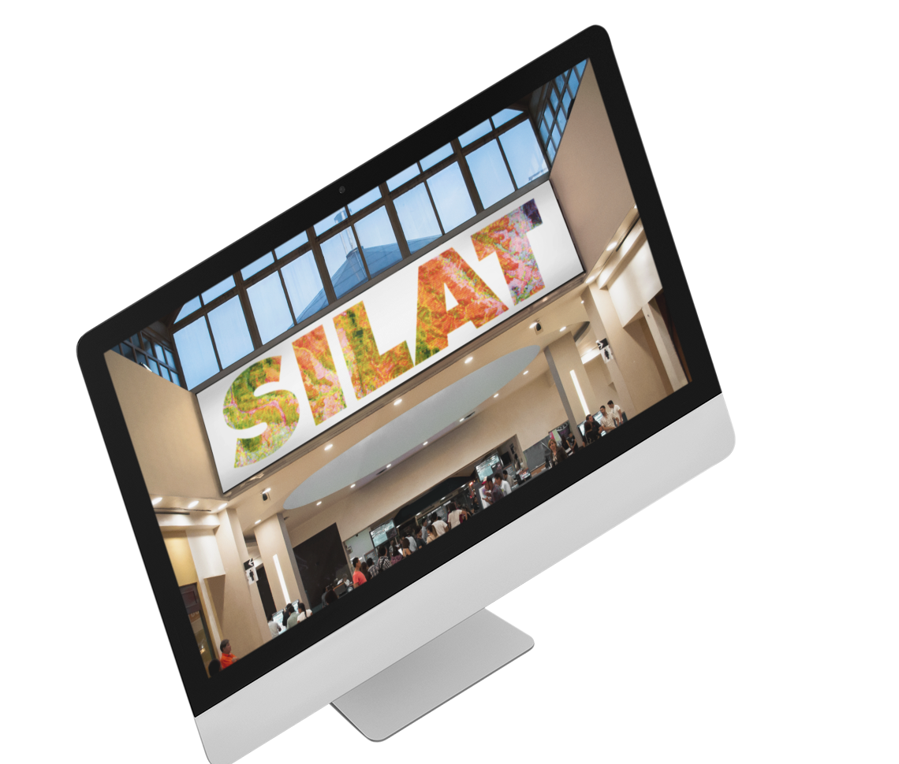

When computer science and geography come together, the power to collect, store, manage, query, visualize spatial data, and output maps is unleashed. This informs our choices about where we live and how things happen. The advanced MSc SILAT will give you these tools. Below are my top 10 reasons to choose this university program.. SILAT stands for “Systèmes d’informations localisées pour l’aménagement des territoires” [Localized Information Systems for Land Management] and it’s part of AgroParisTech University’s executive program. The MSc is based at “Maison de la Télédétection” [House of Remote Sensing], in the south of France. Lecturers primarily are from academic and research institutions (AgroParisTech, CIRAD, IRD and Irstea).

Choosing between programs within the AgroParisTech University executive MSc program is challenging, each of them seems cool. In my case, spatial data science was a good fit for my background in Environmental Science. Here are some reasons for my choice of the SILAT MSc:

### 1 - Location: Place matters

We need Geo-information or localized information because things happen in our country and continent, state, city or town or street. How close or how far away is something that may or may not affect us? We are constantly thinking spatially, for example, anytime we point someone to the next road or a particular restaurant they’re looking for that is just a couple blocks away. For all my previous academic projects, I needed to map places. So yes, place matters!

### 2 – Market Demand

It is important to better understand the limitless potential of Geo-information in many areas, such as agriculture, forestry, urban planning, banking, climate change, the environment or biodiversity. Learning how to work with geospatial data is an excellent way to open doors to a future career. GIS data is used for many applications across many fields. It’s everywhere!

### 3 - High standards of teaching

SILAT offers well-illustrated lectures by instructors (mainly researchers), as well as guest lectures by representatives of companies or the public services. This ensures students are hearing and seeing a variety of viewpoints and using a variety of Geographic Information System (GIS) and remote sensing tools. Each week, they use these tools in interactive mapping, showcasing real-world case studies of GIS, mainly from Europe and Africa.

### 4 - Variety of courses

There are four academic disciplines related to spatial data science: Geographic Information System (GIS), Database Management System (DBMS), Data Analytics, and Spatial Big Data Systems. In addition, SILAT covers most of spatial data science and all five GIS layers: spatial reference frameworks, spatial data models, spatial data acquisition systems, spatial data analysis, and geo-visualization. Data analytics also are covered, and some Big Data tools.

### 5 - Project management skills

Progressing through the MSc leads to the discovered of the interrelationships between the technical and human aspects of GIS strategies. The program concludes with a personal GIS project or exercise in field research, with feedback from peers. At the end of the program, each student writes a thesis that must be approved by the committee of lecturers. Students also present their projects at a public seminar, open to all in the related field of GIS outside the school

### 6 - Partnership

One of the best things about this MSc is the partnership with companies, academic and research institutions. Students are required to submit a proposed project in partnership with a host company or research lab that will cover training costs. According to the type of project, every student is supported by a personal supervisor.

### 7 - Financial aid

The government of France and some local and regional organizations offer a very generous financial assistance program. Those who are not from France or Europe can benefit from many other programs, such as the Joint Japan/World Bank Graduate Scholarship Program (JJ/WBGSP), which helps mid-career professionals in developing countries or Japan.

### 8 - Research opportunities

Most lecturers (teacher-researchers) are affiliated with different laboratories, and play an important role not only in supervising students but in research activities.

### 9 - Housing and people

Having lived in Paris, and heard about housing costs in Geneva or New York, Montpelier is ideal. Ninety-five per cent of students live on campus, which is different than most schools. There are a few cultural sensitivities to be mindful of, such as using “s’il vous plaît” at the end of all requests. (“Voulez-vous coucher avec moi?” seems to be a joke that people make about France, but they don’t think it’s funny.)

### 10 The beauty of the south

When you go south you never go back north. Like many coastal locations, the south of France – with its beaches, breezes, high temperatures and mountains – is a beautiful and magical to live. However, the unemployment rate is high, which can present a challenge.
