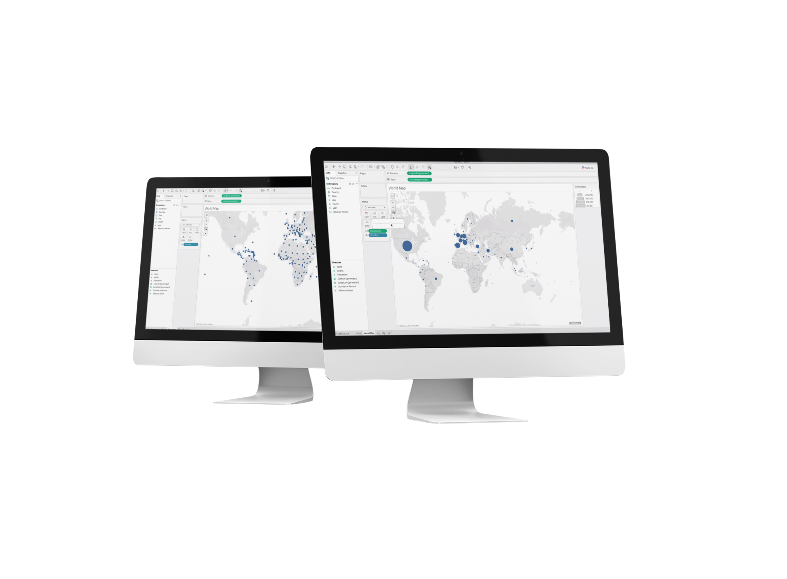
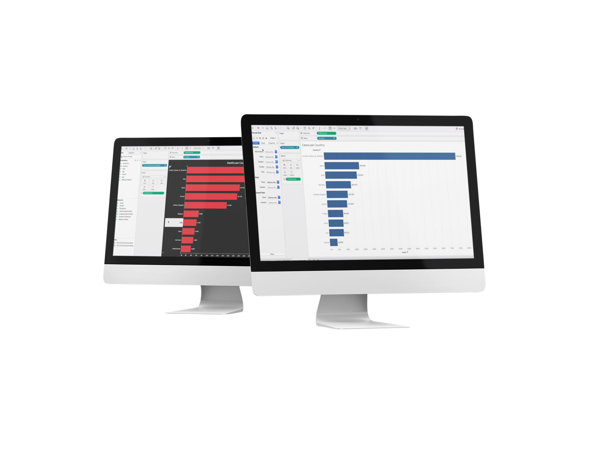

According to _Harvard Business Review_ , data science is “the sexiest job of the 21st century.” That’s because we are living in a data-rich world and many people, companies and countries don’t know what do with it all.

In this post, I’ll explain how to build your own dashboard, like this <a href="https://public.tableau.com/profile/crestoni#!/vizhome/COVID-19Dashboard_15872243969970/DashboardCOVID19" target="_blank">one</a> using <a href="https://public.tableau.com/s/" target="_blank">Tableau</a>, a data visualization tool that enables to do this without writing a single line of code.


Last update: 04/17/2020

### 1- Download and install Tableau

Once you have downloaded the trial version of Tableau, click “continue” to launch the installation, and follow all the default instructions.

### 2- Creating a data source

Now that Tableau is up and running, its time to import or open your data using Google sheets. Make sure the data is relevant and authoritative, to ensure that the dashboard is credible. For this example, data has been generously provided by the European Union, through the <a href="https://data.europa.eu/euodp/en/data/dataset/covid-19-coronavirus-data" target="_blank">EU Open Data Portal.</a>.

As soon as the data is ready, connect it to Tableau workbook Desktop.

### 3- Connecting data to Tableau

Tableau has a lot of options to connect data, stored in different places: it might be stored on a local computer in a spreadsheet or text file; it could come from a public domain such as U.S. Census Bureau; or you might insert it from a cloud database source. In this case, I am using Google sheet data source.

Tableau desktop needs authorization to link with the Google account, in order to import the date. The window below shows data is connected. Another dataset can be added, but I only used one sheet. It’s good practice to rename the source of data and the sheet.

To explore data, there two different views that can be used: a normal table view, or a view of just headings (metadata). It’s also possible to re-order columns, or filter specific areas or items.

### 4- Preparing the data for analysis

When you connect to a new data source, Tableau assigns each field in the data source as a dimension or measure in the Data pane, depending on the type of data the field contains. You use these fields to create views of your data.

To check the number of records, click, drag and drop it into Tableau. A small bar chart will appear.Before moving forward in building a chart, it’s wise to audit your data to ensure it makes sense. Is it reliable?

### 5- Creating a chart or map within Tableau

There are two steps to create a basic Tableau bar, chart or map.

1.  Drag and drop a “measure” field from the lower left of the screen to the “rows” shelf at the top of the screen.
2.  Drag and drop a “dimension” field from the upper left of the screen to the “columns” shelf at the top of the screen.

To map the number of cases according to size, click on “cases,” drag over to the “size” section and drop it. So, if a country has a lot cases, it should have a larger dot. Otherwise, it should have a small dot. This is simple to do in Tableau.



MMaps in Tableau are like scatter plots with a background image. Tableau will plot a point at each intersection of the latitude on the Y-axis and the longitude on the X-axis. The following two images illustrate the scatter plot concept: one shows the latitude and longitude plotted with no background image; and below, the same data points are plotted with a background image of the world in a dark color.

To only show the top 10 countries, create a new chart on Tableau. It’s possible to edit it, add more information and change the color.



### 6- How Tableau can help with calculations

Sometimes data source does not contain a field (or column) needed for analysis. For example, it might contain fields with values for death or the number of cases, but not for Mortality Rate (MR). In this case, I created a calculated field for mortality rate using data from the deaths field.

Here are a few examples below:

#### Total Cases

```javascript
SUM(Cases);
```

#### Total Deaths

```javascript
SUM(Deaths);
```

#### Mortality Rate

The mortality rate would be the percentage of people confirmed to have Covid who died. The default number format of MR is % (make sure to change this format). The formula would be the sum of deaths over the sum of cases.

```javascript
SUM(Deaths) / SUM(Cases);
```

#### Growth formula

Then calculate the growth to compare the number of cases month over month.

```javascript
SUM(Cases this Month ) - SUM(Cases last Month) / SUM(Cases last Month )
```

### 7- Building a dashboard

After creating, reviewing and analyzing the date, you can use your dashboard to display multiple worksheets at once, and—if you want—have them interact with one another.

When you’re ready to create a Tableau dashboard in an existing workbook, right-click on the “Tab” list or “Filmstrip” view and choose “New Dashboard” from the context menu, then click the “New Dashboard” tab at the bottom of the workspace, or choose “Dashboard” or “New Dashboard” from the drop-down menu.

A blank dashboard will appear with the data window replaced by four sections: a list of existing worksheets in the workbook; a selection of additional dashboard elements; a layout section containing the organization of items added to the dashboard; and a sizing section for customizing the size of dashboard elements.
The next and final step will be to put your dashboard online.

### 8- Publishing your dashboard

Tableau content can be published to the Tableau server, distributed via Tableau Mobile, Tableau Reader, Tableau Desktop or sent as static images. Each option has different capabilities, security models and requirements.

Tableau Server and Tableau Online are great options for publishing and sharing Tableau content. Tableau Server provides browser-based analytics without the need to download software. Within Tableau, navigate to the top bar, click on “Server,” scroll down to “Tableau Public” and click “save.” Then you will be asked to sign into your account.
